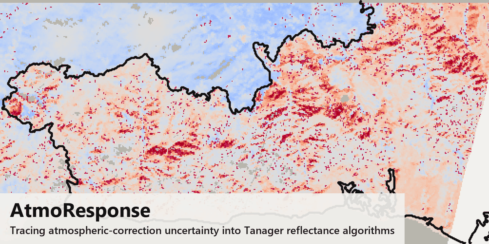

# AtmoResponse

[](https://github.com/ppeshette/AtmoResponse/actions/workflows/ci.yml)
[](LICENSE)




**AtmoResponse is an open-source Python package for quantifying how atmospheric-correction
uncertainty propagates into the algorithms that turn Tanager and EMIT reflectance products into
scientific results.**

AtmoResponse runs scene-scale sensitivity analysis for Tanager and EMIT, resolving an external
aerosol optical depth from AERONET, GOES, VIIRS, or MERRA-2 and providing a library of reusable
spectral-algorithm recipes, masking and validity tools, and cache-first access to public catalogs
and scene assets.
Reconstructing reflectance at a different aerosol optical depth normally means a radiative-transfer
calculation at every pixel. Precomputed 6S coefficient tables reduce that to a table lookup and a
short algebra step, which is what makes a scene-scale comparison tractable.

## Capabilities

- Tanager and EMIT scene discovery and access from public catalogs
- Aerosol optical depth reference selection from AERONET, GOES, VIIRS, and MERRA-2
- Look-up-table atmospheric correction at an assumed aerosol optical depth, one table per sensor
- Scene-scale Potential and Realized Sensitivity workflows
- Reusable reflectance-algorithm recipes and fixed spectral libraries
- Cloud, nodata, look-up-table-coverage, and finite-input validity masking
- Offline test suite, runnable examples, and an annotated notebook

## How it works

AtmoResponse takes a user-supplied algorithm, a delivered scene, and an area of interest, where an
algorithm is any function that maps a set of wavelengths and their reflectances to a score or a
label. It computes two measures of aerosol-assumption sensitivity.

Potential Sensitivity sweeps representative pixels across a plausible aerosol-optical-depth range
and re-applies the algorithm at each step, characterizing its construction independently of any
single scene. Realized Sensitivity corrects every pixel in the area of interest twice, once at the
aerosol optical depth the mission's atmospheric correction assumed and once at an independent value
from AERONET, GOES, VIIRS, or MERRA-2. The difference between the two corrections isolates the part
of the algorithm's output that follows from the aerosol assumption rather than from the surface.

Potential and Realized Sensitivity are computed entirely from look-up-table corrections. Each
compares reflectance reconstructed at different aerosol optical depths, never a reconstruction
against the delivered product or a measured reflectance. A systematic look-up-table bias cancels in
that difference, so the result is a sensitivity, not an error. The readout matches how the algorithm
is built: the fraction of pixels reassigned for a classifier, the fraction of the scene where the
output stays defined for a ratio that can diverge, or the fraction of output variance the aerosol
assumption drives for a continuous score.

A precomputed table of 6S radiative-transfer solutions, spanning solar and view geometry, column
water vapor, ozone, aerosol model, and aerosol optical depth, supplies the corrections at both
aerosol values. Precomputing the table is a multi-day job. Once it exists, a full-scene comparison
runs in minutes.

For worked examples, the case-study figures, and a runnable end-to-end walkthrough, see
[`report/`](report/) and [`notebooks/`](notebooks/).

## Background and scope

AtmoResponse grew out of a 2026 research effort into how uncertainty in atmospheric state, and in
aerosol optical depth in particular, affects the downstream analysis of imaging-spectroscopy
reflectance.

Prior work has established the mechanism this package builds on. Miura et al. (2001) measured how
residual atmospheric-correction error moves vegetation indices, and Bhatia et al. (2018) propagated
atmospheric-parameter uncertainty through hyperspectral unmixing. In a 2026 study, Blessing and
Giering characterized the band-to-band error covariance that atmospheric correction introduces and
carried it into vegetation-index uncertainty. AtmoResponse operationalizes that line of work as a
reusable, scene-scale workflow for two operational imaging spectrometers. Its contribution is the
integration and reproducibility of that workflow.

The delivered reflectance for both sensors comes from an optimal-estimation retrieval (Thompson et
al. 2018) that solves for surface and atmospheric state together and reports the posterior
uncertainty on that estimate. AtmoResponse asks a narrower and more applied question: given a
delivered product and the aerosol optical depth it assumed, how much would the scientific
interpretation change under another plausible aerosol state drawn from independent evidence? The two
are complementary. AtmoResponse does not reproduce the retrieval's posterior covariance and does not
set out to replace it.

AtmoResponse was originally developed for the Planet Tanager Open Data Competition. The `v0.1.0` tag
is the version submitted on August 31, 2026. The [project summary](report/PROJECT_SUMMARY.pdf) and the
[annotated notebook](notebooks/walkthrough.ipynb) were the competition deliverables. This repository continues as the
public project and software package. Full references are in [`REFERENCES.md`](REFERENCES.md).

## Repository layout

The repository holds source, tests, the report, the notebook, and small bundled assets. Scene data,
bulky derived products, the local data directory, and credentials stay out of version control.

| Path | Purpose |
|---|---|
| `src/atmoresponse/` | Installable Python package |
| `src/atmoresponse/recipes/` | Reflectance-algorithm examples exposed as recipes |
| `src/atmoresponse/masks.py` | Mask composition helpers for recipe outputs and scene validity gates |
| `src/atmoresponse/assets/` | Bundled runtime data and reference files, with provenance in its own README |
| `tests/` | Offline smoke tests and formula fixtures |
| `notebooks/` | Annotated executable walkthrough |
| `report/` | Project summary, method notes, acquisition targets, and figure captions |
| `examples/` | Small runnable entry points and configuration examples |

## Install

```bash
conda env create -f environment.yml
conda activate atmoresponse
```

That installs the package (editable) with everything: tests, live data access, the
geo stack, plotting, the notebook, and the PDF tooling. Then:

```bash
python -m pytest                        # the offline suite
python examples/quickstart.py           # offline demo
jupyter lab notebooks/walkthrough.ipynb # the annotated walkthrough
```

Without conda, `pip install "atmoresponse[notebook]"` from a clone gives the notebook
setup. Bare `pip install .` gives the minimal library. Add `[live]`, `[geo]`, `[plot]`,
`[report]`, or `[dev]` as needed. On Windows in particular, the geo stack (rasterio,
geopandas) installs more reliably from conda than from pip.

## Recipe API

Algorithm examples are exposed from `atmoresponse.recipes`. Import formula recipes directly from
that package, and import full-spectrum helpers from their recipe modules:

```python
from atmoresponse.recipes import cyanobacteria_index
from atmoresponse.recipes.sam import prepare_sam_classifier
from atmoresponse.recipes.wildfire_sam import prepare_wildfire_sam
```

For repeated SAM scoring, prepare the fixed library once for a scene wavelength grid, then call
`evaluate_many()` on band-last spectra. Use `selected_wavelengths_nm` when choosing which bands to
read or atmospherically correct upstream.

`atmoresponse.recipes.water` exposes MNDWI as a recipe. `atmoresponse.masks` combines recipe outputs
with cloud, nodata, look-up-table-coverage, and finite-input validity gates.

## Data access

Default examples run against public Planet STAC metadata and public Tanager scene assets. Some
external aerosol references require user-owned credentials. Credentialed paths fail with readable
setup messages when credentials are absent.

Bundled example spectra are limited to small fixed libraries with visible provenance. See `NOTICE`
and the JSON manifests under `src/atmoresponse/assets/` for source credits and intended-use limits.

AtmoResponse walks Planet's static Tanager STAC catalog directly and does not require a STAC API
server for catalog search. EMIT catalog searches use NASA CMR and can target either L2A reflectance
or L1B radiance products.

Downloads are cache-first: a scene, look-up-table archive, or reference file already present is
reused rather than fetched again. Downloads persist between runs and are not deleted automatically.
Set `ATMORESPONSE_DATA` to place the data directory where you want it. Unset, it defaults to
`~/atmoresponse_data`. Each download is written to a temporary file first, then moved into place
when complete.

## Look-up table

Potential and Realized Sensitivity are computed against a precomputed look-up table of
atmospheric-correction coefficients, one table per sensor. Each table holds the 6S
radiative-transfer coefficients for a fixed grid of solar and view geometry, column water vapor,
ozone, aerosol model, aerosol optical depth, and sensor band. A reflectance retrieval at an assumed
aerosol optical depth is then a table lookup plus a short algebra step rather than a live
radiative-transfer call, which is what makes a full-scene comparison at two values tractable.

The package ships only the axis definitions, `src/atmoresponse/assets/lut/axes_tanager.json` and
`axes_emit.json`. The coefficient store is large and is distributed separately as a per-sensor
archive on Zenodo. Fetch and unpack it with `download_lut`:

```python
from atmoresponse.downloads import download_lut

store = download_lut("tanager")            # into the data directory, idempotent
result = run_tanager(..., lut=store)
```

`download_lut` returns the store directory (the one containing `shards/`). Point
`LUT_STORE_TANAGER` or `LUT_STORE_EMIT` at it instead, or pass it to `run_tanager` or `run_emit`
as `lut=`. The Tanager and EMIT tables are Zenodo records
[10.5281/zenodo.22210933](https://doi.org/10.5281/zenodo.22210933) and
[10.5281/zenodo.22210726](https://doi.org/10.5281/zenodo.22210726). Pass `url=` to fetch a
different archive.

The pipeline that generated the tables, the 6S forward-model driver and the shard store layout, is
outside this release. The method is described in `report/METHOD_NOTES.md`.

## Package surface

The public API covers shared scene models, a source-neutral hyperspectral cube, cache-first
downloads into the local data directory, Tanager and EMIT catalog access, surface classification,
and per-sensor adapters. On the atmospheric side it adds shipped-aerosol summaries, reference
selection from AERONET, GOES, VIIRS, and MERRA-2, the look-up-table consumer layer, the archive
download helper `download_lut`, and the per-sensor runners `run_tanager` and `run_emit`. On the
algorithm side it adds the figure primitives, fixed-library SAM primitives, the bundled wildfire SAM
library, and the RSI, Sims and Gamon water-index, Wynne Cyanobacteria Index, QAA v6 CDOM, and AlOH
example algorithms. GOES reads public NOAA buckets. VIIRS and MERRA-2 use Earthdata-backed
dependencies and credentials.

## Acknowledgements

Anthropic Claude Code and OpenAI Codex supported implementation, code review, and analysis
throughout development. I wrote, edited, or reviewed all content published in this repository.
